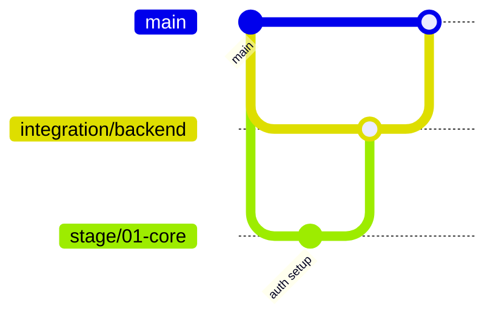

# MVP Git Branch Structure Design

## Overview

Design and create a strategic git branch structure for multi-stage MVP implementation based on stages defined in the Technical PRD. Converts implementation stages into a concrete branching strategy with AI agent workflow integration.

**Core principle:** Stage dependencies + parallel execution capability = branch structure design.

### VS Code Environment Constraint

**Important:** When the Co-CEO runs in VS Code GLM-5 extension, all spawned agents share the same working directory. This fundamentally limits parallelization:

- Git worktrees create separate directories, but agents cannot work in different directories
- Multiple agents editing the same branch simultaneously causes conflicts
- Branch switching while an agent is running causes state inconsistency

**Implication for branch design:** Branches provide organizational separation and rollback capability, but NOT concurrent execution. The Co-CEO must orchestrate sequential execution with branch switching between stages. See `slimmed-strategic-co-ceo-process.md` Phase 6.1 for orchestration details.

**Announce at start:** "I'm using the mvp-git-structure-design skill to design the git branch structure."

## When to Use

Use this skill when:
- Technical PRD has been completed with defined implementation stages
- Need to create branch structure for multi-stage development
- Multiple AI agents will work on different stages (parallel or sequential)
- **After** `mvp-technical-prd-architecture` skill has run

Do NOT use for:
- Single-stage projects (use simple trunk-based directly)
- Individual feature branches (covered in git-ai-workflow.md)
- Mid-implementation restructuring (requires different approach)

## Quick Reference

| Stages | Dependencies | Strategy |
|--------|-------------|----------|
| 1-2 | Any | Simple trunk-based |
| 3-4 | Sequential | Linear with stage prefixes |
| 3-4 | Parallel | Stage branches with integration |
| 5 or more | Mixed | Modular with integration branches |

**Note:** For exactly 5 stages, evaluate complexity - simple 5-stage projects may use Stage Branches strategy instead of full Modular approach.

## The Process

### Step 1: Read Technical PRD

**Required input:** `docs/Project-Technical-Architecture.md`

**Validate PRD first:**
```bash
# Verify Section 5 exists
if ! grep -q "## 5. Implementation Stages" docs/Project-Technical-Architecture.md; then
  echo "ERROR: Section 5: Implementation Stages not found in Technical PRD"
  echo "The mvp-technical-prd-architecture skill must run first."
  exit 1
fi
```

Extract from PRD:
```bash
# Look for Section 5: Implementation Stages
grep -A 50 "## 5. Implementation Stages" docs/Project-Technical-Architecture.md
```

For each stage, identify:
- Stage name and number
- Purpose and scope
- **Dependencies on other stages** (hard vs soft)
- Estimated complexity (2-4 hours / 4-8 hours / 8+ hours)
- Files/modules affected

### Step 2: Analyze Stage Characteristics

Build a dependency map:

```markdown
Stage 01: Core Engine (auth, db, RLS)
  Dependencies: None
  Parallel: Can work alone

Stage 02: Backend API (endpoints, n8n)
  Dependencies: Stage 01 (hard - needs auth, db schema)
  Parallel: No - requires Stage 01 complete

Stage 03: Frontend (UI)
  Dependencies: Stage 02 (hard - needs API contracts)
  Parallel: Partial - can start mockups during Stage 02
```

**Dependency types:**
- **Hard dependency:** Stage B cannot start until Stage A is complete and merged
- **Soft dependency:** Stage B can proceed but should merge Stage A before final integration
- **No dependency:** Stages can develop completely in parallel

**Key questions:**
1. Can any stages run in parallel? (different files, no shared dependencies)
2. Are there hard dependencies? (Stage B needs Stage A's output to begin)
3. Are there soft dependencies? (Stage B benefits from Stage A but can start without it)
4. Will multiple agents work simultaneously?
5. Do stages need integration testing before merging to main?

**Validate parallel work claims:**
Check if "Files/Modules Affected" overlap between stages marked as parallel. If files overlap significantly, stages will conflict and should be sequential instead.

**Reality check for parallelization:**
Due to VS Code constraints (all agents share one working directory), true parallel execution is only possible when:
- Stages touch completely different directories with zero overlap
- No shared configuration files (`package.json`, `tsconfig.json`, etc.)
- The Co-CEO spawns all parallel agents in a single message

For most MVPs, **default to sequential execution**. The branch structure still provides value for isolation and rollback, even without parallelization.

### Step 3: Choose Branching Strategy

Use the decision tree in branching-strategies.md. Summary:

**1-2 Stages → Simple Trunk-Based**
- All work branches off `main`
- AI feature branches: `ai/feat/<agent>/S01-<ticket>/<desc>`
- Merge directly to `main` when stage complete

**3-4 Sequential Stages → Linear with Prefixes**
- All work off `main`
- AI branches tagged with stage: `ai/feat/<agent>/S02-TASK-101/<desc>`
- Complete Stage 01 → merge → start Stage 02

**3-4 Parallel Stages → Stage Branches**
- Create long-lived stage branches: `stage/01-core-engine`
- AI branches off stage branch: `ai/feat/<agent>/TASK-101/<desc>`
- Merge stage branches to `integration/backend` → test → merge to `main`

**5+ Stages → Modular with Integration**
- Group related stages
- Use integration branches per group
- Example: `integration/backend` collects stages 01-03, `integration/frontend` for stage 04

See branching-strategies.md for detailed patterns.

### Step 4: Create Git-Branch-Structure.md

Create `docs/Git-Branch-Structure.md` using template:

**Required sections:**
1. **Overview** - Why this structure was chosen (2-3 sentences)
2. **Branch Structure Diagram** - ASCII art or Mermaid showing branches
3. **Branch Types Table** - All branch types with purpose, base, merge target
4. **Stage-to-Branch Mapping** - Which stages use which branches
5. **Merge Flow** - Diagram showing merge sequence
6. **Stage Sequencing** - Order and dependencies
7. **Branch Protection Rules** - What rules apply to each branch type
8. **Git Commands Reference** - Commands for common operations
9. **Conflict Resolution Strategy** - How to handle conflicts between stages
10. **CI/CD Integration** - Which jobs run on which branches
11. **Automation Scripts** - Shell script to create branch structure

Use git-branch-structure-template.md as starting point.

**Placeholder fill guide:**
- `[Project Name]` → From PRD Section 1
- `[N]` (total stages) → Count from Section 5
- `[branch-name]`, `[stage-name]` → From Step 3 strategy choice
- `[agent]` → Keep as placeholder (filled during actual dev)
- Status values → "Active" for Stage 01, "Planned" for others
- Merge flow diagrams → Copy from chosen strategy in branching-strategies.md

**Enhance with Mermaid diagrams:**


### Step 5: Update Technical PRD

Update `docs/Project-Technical-Architecture.md`:

**Section 7: Git Workflow for AI Agents**

Add or enhance:
```markdown
## 7. Git Workflow for AI Agents

### Branch Structure

See [Git-Branch-Structure.md](Git-Branch-Structure.md) for complete structure.

**Summary:**
- Main branch: `main`
- Stage branches: [list if applicable]
- AI feature branches: `ai/<type>/<agent>/<stage>-<ticket>/<desc>`

### Stage-Specific Workflow

**Stage 01: Core Engine**
- Base branch: `main`
- AI branches: `ai/feat/<agent>/S01-<ticket>/<desc>`
- Merge target: `main` (after all Stage 01 tasks complete)

**Stage 02: Backend API**
- Base branch: `stage/02-backend-api` (or `main` if sequential)
- AI branches: `ai/feat/<agent>/S02-<ticket>/<desc>`
- Merge target: `integration/backend` then `main`

[Continue for each stage...]
```

### Step 6: Create Actual Branches (Optional)

**Order of operations:**
1. Create and commit Git-Branch-Structure.md (Step 4)
2. Update and commit Technical PRD (Step 5)
3. **Then** optionally create branches (this step)

**CRITICAL: Get user confirmation first.**

Ask user:
```
I've designed the branch structure and committed the documentation.
Create the following branches now?

- stage/01-core-engine (off main)
- stage/02-backend-api (off main)
- integration/backend (off main)

This will NOT push to remote yet. Create locally? (yes/no)
```

If yes:
```bash
# Ensure on main and up to date
git checkout main
git pull origin main

# Create stage branches
git branch stage/01-core-engine main
git branch stage/02-backend-api main

# Create integration branches if needed
git branch integration/backend main

# List created branches
git branch --list 'stage/*' 'integration/*'
```

**DO NOT push** branches to remote yet - user will push when ready.

**Generate automation script:**
Add to `docs/Git-Branch-Structure.md` a complete bash script users can run to recreate the structure (see template section 11).

### Step 7: Document Branch Protection Rules

In Git-Branch-Structure.md, document (don't execute) protection rules:

```markdown
## Branch Protection Rules

### `main` branch
- Require 1 approval
- Dismiss stale reviews: true
- Require status checks: lint, test, build
- Restrict pushes: humans only (no direct AI agent pushes)

### `stage/*` branches
- Require status checks: lint, test
- Allow AI agent direct pushes: yes
- Squash on merge to integration/main: yes

### `integration/*` branches
- Require all tests pass
- Require human review before merging to main
```

**Note to user:** These must be configured in GitHub/GitLab settings.

## Outputs

This skill produces:

1. **`docs/Git-Branch-Structure.md`** - Complete branch structure documentation
2. **Updated `docs/Project-Technical-Architecture.md`** - Section 7 enhanced
3. **Actual branches** (optional, with user confirmation)
4. **Commits** - All changes committed to current branch

## Multi-Stage Patterns

### Pattern 1: Backend-First Sequential (3 stages)

```
main
└─ All AI branches merge here after each stage completes

AI branch naming:
- ai/feat/agent1/S01-TASK-101/setup-auth
- ai/feat/agent2/S02-TASK-201/user-endpoints
- ai/feat/agent3/S03-TASK-301/dashboard-ui
```

**When to use:** Simple MVPs, stages build on each other, low conflict risk

### Pattern 2: Parallel Backend Development (4 stages)

```
main
└─ integration/backend
   ├─ stage/01-auth
   │  └─ ai/feat/agent1/TASK-101/jwt-middleware
   ├─ stage/02-billing
   │  └─ ai/feat/agent2/TASK-201/stripe-integration
   └─ stage/03-api-gateway
      └─ ai/feat/agent3/TASK-301/rate-limiting

integration/frontend
└─ stage/04-ui
   └─ (human-led with AI assistance)
```

**When to use:** Stages can develop in parallel, need integration testing, multiple agents working simultaneously

### Pattern 3: Modular Multi-Stage (6+ stages)

```
main
├─ integration/core (stages 01-02)
│  ├─ stage/01-auth
│  └─ stage/02-database
├─ integration/features (stages 03-05)
│  ├─ stage/03-analytics
│  ├─ stage/04-notifications
│  └─ stage/05-integrations
└─ integration/frontend (stage 06)
   └─ stage/06-ui
```

**When to use:** Large MVPs, many stages, logical groupings, phased integration testing

## Edge Cases

### Circular Dependencies Detected

If Stage A depends on Stage B and Stage B depends on Stage A:

**Detection:** For each stage, trace dependency chain. If you encounter the same stage twice in a chain, cycle detected.

**Example:** Stage 04 → Stage 03 → Stage 02 → Stage 04 ✗ CYCLE!

**Action:**
1. Stop immediately
2. Report to user: "Circular dependency detected: [show cycle chain]"
3. Explain: "The Technical PRD needs revision to break this cycle."
4. Suggest: "Consider if one dependency could be soft instead of hard"
5. **DO NOT** proceed with branch structure

### Stage Needs Splitting Mid-Development

If a stage is too large and needs splitting after branches exist:

**Procedure:**
1. Create new stage branch: `stage/02b-<new-scope>`
2. Update Git-Branch-Structure.md with new stage
3. Update stage numbering in documentation
4. Move relevant AI branches to new base
5. Update PRD Section 5 with revised stages

### Multiple Stages Must Integrate Before Main

Use integration branches:
```
main
└─ integration/combined
   ├─ stage/01-core
   ├─ stage/02-api
   └─ stage/03-workers
```

Merge all stages to `integration/combined` → test → merge to `main`

### Integration Branch Merge Order

When `integration/frontend` depends on `integration/backend`:

**Solution:**
1. Merge `integration/backend` to `main` first
2. Update `integration/frontend` from `main` (gets backend changes)
3. Then merge `integration/frontend` to `main`

**Rule:** Merge integrations in dependency order; dependent integrations pull from main between merges.

### Soft Dependencies with Parallel Work

When Stage B has hard dependency on A and soft dependency on C:

**Example:**
- Stage 02: Task API (hard dep on Stage 01: Auth)
- Stage 03: Team Management (hard dep on Stage 01: Auth, no relation to Stage 02)
- Stage 04: Realtime (hard dep on Stage 02, soft dep on Stage 03)

**Approach:**
1. Stages 02 and 03 can develop in parallel after Stage 01
2. Stage 04 branches off Stage 02 (hard dependency)
3. Before Stage 04 integration testing, merge Stage 03 to integration branch
4. This satisfies soft dependency without blocking Stage 04 start

**Branch structure:**
```
stage/02-task-api → integration/backend
stage/03-team-mgmt → integration/backend
stage/04-realtime (off stage/02) → integration/backend (after 03 merged)
```

### New Project (No Main Branch Yet)

**Prerequisite checks:**
```bash
# Check if main/master exists
git rev-parse --verify main 2>/dev/null || git rev-parse --verify master 2>/dev/null
```

If neither exists:
```bash
# Initialize with .gitignore first
git checkout -b main
git add .gitignore
git commit -m "chore: initialize repository with .gitignore"
```

Then proceed with branch structure.

## Common Mistakes

### Creating branches without understanding dependencies
- **Problem:** Parallel stage branches when stages are sequential → merge conflicts
- **Fix:** Always build dependency map first (Step 2)

### No integration testing strategy
- **Problem:** Stage branches merge directly to main → untested integration
- **Fix:** Use integration branches for 4+ parallel stages

### Inconsistent branch naming
- **Problem:** Some use `stage/01`, others use `feature/stage-01` → confusion
- **Fix:** Standardize in Git-Branch-Structure.md, enforce in reviews

### Forgetting to update PRD
- **Problem:** Branch structure exists but PRD Section 7 unchanged → agents don't know where to branch from
- **Fix:** Always update PRD Section 7 (Step 5)

## Red Flags

**Never:**
- Create branches before analyzing dependencies
- Push branches before user confirmation
- Skip creating Git-Branch-Structure.md documentation
- Design structure conflicting with git-ai-workflow.md patterns
- Proceed with circular dependencies

**Always:**
- Read Technical PRD Section 5 first
- Build dependency map
- Get user confirmation before creating branches
- Update both Git-Branch-Structure.md AND Technical PRD
- Use existing AI branch naming from git-ai-workflow.md

## Integration with Other Skills

**Before this skill:**
- **mvp-technical-prd-architecture** - REQUIRED, provides implementation stages
- Master Concept, UX Design, Brand Kit must be complete

**After this skill:**
- **writing-plans** - Uses branch structure to assign tasks to branches
- **subagent-driven-development** - Agents know which base branch to use per stage
- **executing-plans** - Plans reference specific stage branches

**Coordinates with:**
- **mvp-technical-prd-architecture/git-ai-workflow.md** - Uses their AI branch naming pattern (`ai/<type>/<agent>/...`)
- **using-git-worktrees** - Worktrees created off appropriate stage branch

## Reference Files

For detailed patterns and templates:
- [branching-strategies.md](branching-strategies.md) - Decision tree and strategy details
- [git-branch-structure-template.md](git-branch-structure-template.md) - Template for output document
