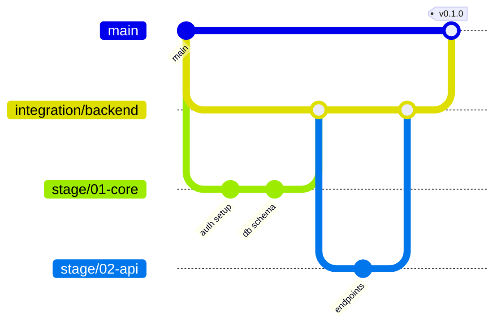

# Git Branch Structure for [Project Name]

Version: 1.0.0 | Date: YYYY-MM-DD | Status: Active

## Overview

[1-3 sentences explaining why this branching structure was chosen for this project. Reference the number of stages, whether they're parallel/sequential, and the main strategy being used.]

**Strategy:** [Simple Trunk-Based | Linear with Stage Prefixes | Stage Branches with Integration | Modular with Integration Branches]

**Total Stages:** [N]

**Parallel Execution:** [Yes/No/Partial]

## Branch Structure Diagram

### ASCII Diagram

```
main (protected)
│
├─ [branch-type]/[branch-name]
│  ├─ ai/feat/[agent]/[ticket]/[description]
│  └─ ai/fix/[agent]/[ticket]/[description]
│
└─ [additional branches...]
```

[Replace with actual structure for chosen strategy]

### Mermaid Diagram



[Customize based on your chosen strategy]

## Branch Types

### Main Branch

- **Name:** `main`
- **Purpose:** Production-ready code, stable baseline
- **Protection:** Yes (see Branch Protection Rules)
- **Base:** N/A (trunk)
- **Merge Target:** N/A (receives merges)
- **Lifetime:** Permanent

### Stage Branches (if applicable)

| Branch | Purpose | Base | Merge Target | Status | Notes |
|--------|---------|------|--------------|--------|-------|
| `stage/01-[name]` | [Purpose of stage 01] | `main` | `integration/[group]` or `main` | Active | [Dependencies, special notes] |
| `stage/02-[name]` | [Purpose of stage 02] | `main` | `integration/[group]` or `main` | Planned | Starts after Stage 01 complete |
| ... | ... | ... | ... | ... | ... |

**Status values:** Active | Planned | In Progress | Complete | Archived

### Integration Branches (if applicable)

| Branch | Purpose | Combines | Merge Target | Lifetime |
|--------|---------|----------|--------------|----------|
| `integration/[group]` | Integration testing for [group description] | stage/01, stage/02 | `main` | Short (delete after merge to main) |

### AI Agent Feature Branches

**Naming Convention:** `ai/<type>/<agent>/<stage>-<ticket>/<description>`

**Components:**
- `<type>`: feat | fix | refactor | docs | test | chore
- `<agent>`: Agent name (e.g., copilot, claude, cursor)
- `<stage>`: S01, S02, etc. (or TASK if no stage prefix needed)
- `<ticket>`: Ticket/task ID from project tracking
- `<description>`: Short kebab-case description

**Examples:**
- `ai/feat/copilot/S01-TASK-101/supabase-auth-setup`
- `ai/fix/claude/S02-BUG-45/null-check-user-profile`
- `ai/refactor/cursor/TASK-301/extract-api-client`

**Base Branch:**
- [For Simple/Linear strategies]: `main`
- [For Stage Branches strategy]: Appropriate `stage/*` branch
- [For Modular strategy]: Appropriate `stage/*` branch within group

**Merge Target:** Same as base (merge back to stage branch or main)

**Lifetime:** Short (hours to days), delete after merge

## Stage-to-Branch Mapping

| Stage # | Stage Name | Branch(es) | AI Branch Example | Status |
|---------|------------|------------|-------------------|--------|
| 01 | [Stage name] | [Branch name or "main"] | `ai/feat/agent/S01-TASK-101/desc` | [Active/Complete/Planned] |
| 02 | [Stage name] | [Branch name or "main"] | `ai/feat/agent/S02-TASK-201/desc` | [Active/Complete/Planned] |
| ... | ... | ... | ... | ... |

## Merge Flow

```
[Diagram showing which branches merge where and in what order]

Example for Stage Branches strategy:

ai/feat/agent/TASK-101/...
  → stage/01-core-engine
    → integration/backend
      → main

ai/feat/agent/TASK-201/...
  → stage/02-api-endpoints
    → integration/backend
      → main
```

## Stage Sequencing

### Stage 01: [Stage Name]

- **Purpose:** [What this stage accomplishes]
- **Dependencies:** None (or: Requires Stage XX complete)
- **Parallel Work:** [Yes/No - explain if yes]
- **Completion Criteria:**
  - [ ] All tasks in Stage 01 merged to [branch]
  - [ ] All tests passing on [branch]
  - [ ] [Any additional criteria]
- **Merge to main:** When [conditions met]

### Stage 02: [Stage Name]

- **Purpose:** [What this stage accomplishes]
- **Dependencies:** Stage 01 must be complete (or: Can start in parallel)
- **Parallel Work:** [Yes/No]
- **Completion Criteria:**
  - [ ] [Criteria]
- **Merge to main:** When [conditions met]

[Continue for each stage...]

## Branch Protection Rules

### `main` Branch

**Enforcement:** GitHub/GitLab branch protection settings

**Rules:**
- ✅ Require pull request before merging
- ✅ Require 1 approval from code owner
- ✅ Dismiss stale pull request approvals when new commits are pushed
- ✅ Require status checks to pass before merging:
  - `lint` (eslint, prettier, etc.)
  - `test` (full test suite)
  - `build` (verify builds successfully)
- ✅ Require branches to be up to date before merging
- ✅ Restrict who can push to matching branches:
  - Humans with write access only
  - **NO direct AI agent pushes**
- ❌ Allow force pushes: Disabled
- ❌ Allow deletions: Disabled

### `stage/*` Branches (if applicable)

**Rules:**
- ✅ Require status checks: `lint`, `test`
- ✅ Allow AI agent direct pushes: Yes (for merging completed tasks)
- ✅ Squash commits when merging to integration/main: Yes
- ⚠️ Require review: Optional (can be skipped for AI merges if tests pass)
- ✅ Delete after merge to main: Yes

### `integration/*` Branches (if applicable)

**Rules:**
- ✅ Require all tests to pass
- ✅ Require human review before merging to main
- ✅ Require approval from technical lead
- ✅ Squash commits when merging to main: Yes
- ✅ Delete after merge to main: Yes

### `ai/*` Branches

**Rules:**
- ✅ No protection (short-lived, feature branches)
- ✅ CI checks must pass before PR can be created
- ✅ Delete immediately after merge
- ✅ Auto-delete after merge: Enabled (GitHub setting)

## Git Commands Reference

### Creating a Stage Branch

```bash
# Create stage branch off main
git checkout main
git pull origin main
git checkout -b stage/01-core-engine
git push -u origin stage/01-core-engine
```

### Creating an AI Feature Branch

```bash
# For Simple/Linear strategies (off main)
git checkout main
git pull origin main
git checkout -b ai/feat/copilot/S01-TASK-101/setup-auth

# For Stage Branches strategy (off stage branch)
git checkout stage/01-core-engine
git pull origin stage/01-core-engine
git checkout -b ai/feat/copilot/TASK-101/setup-auth
```

### Merging AI Branch to Stage Branch

```bash
# Merge completed task to stage branch
git checkout stage/01-core-engine
git pull origin stage/01-core-engine
git merge --squash ai/feat/copilot/TASK-101/setup-auth
git commit -m "feat(auth): implement Supabase authentication setup

Implements TASK-101: Set up Supabase auth with JWT validation.
Includes rate limiting and session management.

Closes #101"

git push origin stage/01-core-engine

# Delete feature branch
git branch -d ai/feat/copilot/TASK-101/setup-auth
git push origin --delete ai/feat/copilot/TASK-101/setup-auth
```

### Merging Stage to Integration Branch

```bash
# Merge stage to integration for testing
git checkout integration/backend
git pull origin integration/backend
git merge --no-ff stage/01-core-engine

# Run integration tests
npm test

# If tests pass, push
git push origin integration/backend
```

### Merging Integration to Main

```bash
# After all integration tests pass
git checkout main
git pull origin main
git merge --squash integration/backend
git commit -m "feat: complete backend core and API stages

Completes Stage 01 (Core Engine) and Stage 02 (API Endpoints).
All integration tests passing.

Stage 01:
- Supabase authentication
- Database schema with RLS
- User profile management

Stage 02:
- User CRUD endpoints
- Project CRUD endpoints
- File upload API"

git push origin main

# Tag the milestone
git tag -a v0.1.0-backend-complete -m "Backend stages 01-02 complete"
git push origin v0.1.0-backend-complete

# Delete integration branch
git branch -d integration/backend
git push origin --delete integration/backend
```

### Verifying Stage Completion

```bash
# Check all tasks for a stage are merged
git log --oneline --grep="S01-" main

# Or for stage branches:
git log --oneline --grep="TASK-" stage/01-core-engine

# Run full test suite
npm test

# Tag stage completion (optional but recommended)
git tag -a stage-01-complete -m "Stage 01: Core Engine complete"
git push origin stage-01-complete
```

## Conflict Resolution Strategy

### Within Same Stage (AI branches conflicting)

**When:** Two AI agents modify the same files in Stage 01

**Resolution:**
1. First PR merges normally
2. Second PR must rebase on updated stage branch:
   ```bash
   git checkout ai/feat/agent2/TASK-102/conflicting-feature
   git fetch origin
   git rebase origin/stage/01-core-engine
   # Resolve conflicts
   git push --force-with-lease
   ```

### Between Stages (Stage branches conflicting)

**When:** Stage 01 and Stage 02 both modified shared files

**Resolution:**
1. Merge Stage 01 to integration/main first
2. Update Stage 02 with Stage 01 changes:
   ```bash
   git checkout stage/02-api-endpoints
   git merge main  # or integration branch
   # Resolve conflicts, prioritizing architectural decisions from PRD
   ```

**Priority Rules:**
1. **PRD wins:** Newer PRD requirements override older code
2. **Core wins:** Core engine decisions override feature decisions
3. **Human wins:** Human architectural decisions override AI code (unless AI change addresses PRD requirement)

### Escalation

If conflicts can't be resolved by AI agents:
1. Stop work on conflicting branch
2. Create GitHub issue documenting conflict
3. Request human review
4. **DO NOT** merge with unresolved semantic conflicts

## CI/CD Integration

### CI Checks per Branch Type

| Branch Type | Runs On | Checks | Required to Pass |
|-------------|---------|--------|------------------|
| `ai/*` | Every push | lint, test (relevant files) | Yes (before PR) |
| `stage/*` | Every push | lint, test (stage scope) | Yes (before merge to integration) |
| `integration/*` | Every push | lint, test (full suite), build | Yes (before merge to main) |
| `main` | Every merge | lint, test, build, deploy staging | Yes (blocking) |

### Additional Checks for AI Branches

```yaml
# .github/workflows/ai-branch-checks.yml
name: AI Branch Checks

on:
  pull_request:
    branches:
      - 'stage/*'
      - 'main'

jobs:
  ai-branch-validation:
    if: startsWith(github.head_ref, 'ai/')
    runs-on: ubuntu-latest
    steps:
      - name: Label PR as AI-generated
        run: gh pr edit ${{ github.event.number }} --add-label "ai-generated"

      - name: Security scan (AI branches only)
        run: npm run security-scan

      - name: Check for secrets
        run: npm run check-secrets
```

### Deployment Triggers

- **Merge to `main`:** Auto-deploy to staging environment
- **Tag `v*.*.*`:** Auto-deploy to production (with approval gate)
- **Integration branches:** Deploy to temporary preview environment (optional)

## Automation Scripts

### Branch Creation Script

Save as `scripts/create-git-structure.sh`:

```bash
#!/bin/bash
set -e

echo "🌳 Creating git branch structure for [Project Name]..."

# Verify we're on main and up to date
current_branch=$(git branch --show-current)
if [ "$current_branch" != "main" ]; then
  echo "❌ ERROR: Must be on main branch (currently on $current_branch)"
  exit 1
fi

echo "📥 Pulling latest from main..."
git pull origin main

# Create integration branches (if using integration strategy)
echo "🔀 Creating integration branches..."
git branch integration/backend main
git branch integration/frontend main

# Create stage branches
echo "📋 Creating stage branches..."
git branch stage/01-[stage-name] main
git branch stage/02-[stage-name] main
git branch stage/03-[stage-name] main
# [Add more as needed]

# List created branches
echo ""
echo "✅ Branches created successfully:"
git branch --list 'stage/*' 'integration/*'

echo ""
echo "ℹ️  Branches are created locally only."
echo "   Review the structure, then push with:"
echo "   git push -u origin --all"
```

**Usage:**
```bash
chmod +x scripts/create-git-structure.sh
./scripts/create-git-structure.sh
```

### Stage Progress Tracker

Track implementation progress in `docs/Stage-Progress.md`:

```markdown
# Implementation Stage Progress

Last Updated: YYYY-MM-DD

## Stage 01: [Stage Name]
- **Status:** ✅ Complete
- **Started:** YYYY-MM-DD
- **Completed:** YYYY-MM-DD
- **Branch:** stage/01-[name] (merged & deleted)
- **Tag:** stage-01-complete
- **Tasks Completed:** 5/5
- **Notes:** All auth and database tests passing

## Stage 02: [Stage Name]
- **Status:** 🔄 In Progress (60%)
- **Started:** YYYY-MM-DD
- **Estimated Completion:** YYYY-MM-DD
- **Branch:** stage/02-[name]
- **Tasks Completed:** 3/5
- **Blockers:** None
- **Notes:** API endpoints functional, integration tests pending

## Stage 03: [Stage Name]
- **Status:** 📅 Planned
- **Dependencies:** Stage 02 must complete first
- **Estimated Start:** YYYY-MM-DD
- **Branch:** Not created yet
- **Tasks:** 0/4

[Continue for all stages...]

## Overall Progress

- **Stages Complete:** 1/5 (20%)
- **Current Phase:** Backend Development
- **Next Milestone:** Complete Stage 02 by YYYY-MM-DD
```

## Special Cases

### Hotfix Process

For critical bugs in production:

```bash
# Create hotfix branch from main
git checkout main
git checkout -b hotfix/critical-auth-bug

# Fix and test
[make changes]
npm test

# Merge directly to main (bypass stage branches)
git checkout main
git merge hotfix/critical-auth-bug
git tag -a hotfix-auth-2025-01-15 -m "Hotfix: critical auth bug"
git push origin main --tags

# Backport to active stage branches if needed
git checkout stage/02-api-endpoints
git cherry-pick [hotfix-commit-hash]
```

### Abandoned Stage

If a stage is cancelled:

```bash
# Archive the stage branch (don't delete - keep history)
git tag -a stage-02-abandoned-2025-01-15 -m "Stage 02 abandoned - feature deprioritized" stage/02-api-endpoints

# Don't merge to main
# Update PRD to mark stage as cancelled
```

## Maintenance

### Periodic Cleanup

**Weekly:**
- [ ] Delete merged AI branches: `git branch --merged | grep 'ai/' | xargs git branch -d`
- [ ] Verify CI passing on all active stage branches

**After Each Stage Completes:**
- [ ] Tag stage completion: `git tag -a stage-0X-complete -m "Stage X complete"`
- [ ] Delete stage branch (if using stage branches): `git branch -d stage/0X-name`
- [ ] Update this document's status table

**After MVP Launch:**
- [ ] Archive all stage/integration branches
- [ ] Switch to production branching strategy (feature flags, release branches)
- [ ] Update branch protection rules for production

## Questions and Exceptions

**Q: Can I create an AI branch directly off main if I'm working on Stage 02 but we're using stage branches?**

A: No. Always branch off the appropriate stage branch. This ensures:
- Correct base for integration testing
- Clear stage boundaries
- Proper merge flow

**Q: Stage 03 is blocked waiting for Stage 01. Can I start Stage 04?**

A: Check the Stage Sequencing section. If Stage 04 has no dependencies on Stage 01 or 03, yes. Create appropriate branch per strategy.

**Q: We need to split Stage 02 into Stage 02a and 02b mid-development. How?**

A: See Edge Cases section in the main skill (SKILL.md). Update PRD, create new stage branch, update this document.

## Document History

| Version | Date | Changes | Author |
|---------|------|---------|--------|
| 1.0.0 | YYYY-MM-DD | Initial branch structure | [Name/Agent] |

---

**Last Updated:** YYYY-MM-DD

**Related Documents:**
- [Project Technical Architecture (PRD)](Project-Technical-Architecture.md)
- [Implementation Plans](../plans/)
