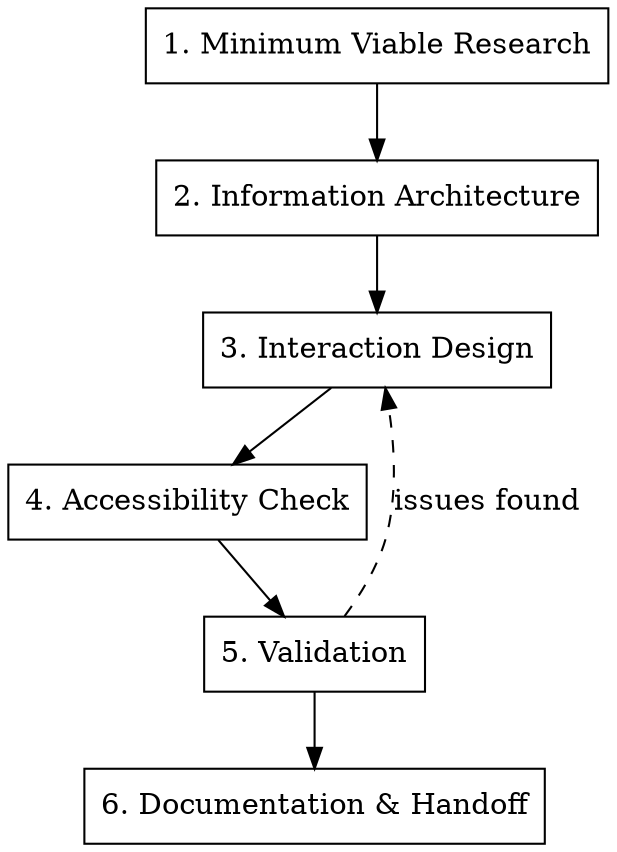

# MVP UX Design

## Overview

Design comprehensive MVP User Experience documentation following industry best practices. Produces a "blueprint" that bridges user needs and engineering requirements.

**Core principle:** "Minimal" refers to feature scope, not experience quality. An MVP must be a "Minimum Lovable Product" to survive user scrutiny.

**Announce at start:** "I'm using the mvp-ux-design skill to design the MVP User Experience."

## Prerequisites

Before running this skill, ensure Phase 1 is complete:

**Required Inputs:**
- `docs/concept/master-concept.md` - Problem, audience, features, JTBD
- `docs/brand/brand-kit-guide.md` - Visual identity, voice, tone

**Marketing Context (from Phase 1.4):**
- `marketing/positioning-angles.md` - How the product is positioned (informs UX messaging)
- `marketing/direct-response-copy.md` - Copy patterns for empty states, onboarding, CTAs

These marketing files inform the UX language, onboarding flows, and empty state messaging.

## When to Use

- Designing user experience for a new MVP
- Creating user flows, wireframes, or interaction specifications
- Documenting UI states (empty, loading, error, ideal)
- Preparing UX handoff documentation for development

**Not for:** Technical architecture, code implementation, visual design polish

## The Process



---

## Phase 1: Minimum Viable Research

**Goal:** Validate core assumptions with minimal effort before design begins.

### The Rule of Five

Test with 5 users matching the target persona. This uncovers 85% of core usability problems.

### Competitive Intelligence

When direct user data unavailable:
1. Identify 3-5 competitors
2. Document "table stakes" features users expect
3. Identify competitor UX gaps = design opportunities

### Deliverable: User-Centric PRD Sections

| Section | Purpose |
|---------|---------|
| **Problem Statement** | Concise user pain point |
| **User Personas** | Tech proficiency + goals (determines UI complexity) |
| **Success Metrics** | e.g., "Time to Value < 5 mins" |
| **MoSCoW Scope** | Must/Should/Could/Won't |
| **Use Cases** | Narrative task descriptions → basis for user flows |
| **Won't Have** | Explicit out-of-scope features |

### Phase 1 Completion Checklist

Before proceeding to Phase 2, verify:
- [ ] Problem statement written (1-2 sentences)
- [ ] 2-3 user personas defined with tech proficiency levels
- [ ] Success metrics are quantifiable and measurable
- [ ] MoSCoW scope clearly separates Must/Should/Could/Won't
- [ ] At least 3 primary use cases documented

---

## Phase 2: Information Architecture

**Goal:** Define system structure, navigation, and user paths.

### User Flows vs Wireflows

**User Flows** (Logic Layer):
- Abstract diagrams with flowchart symbols
- Ovals = Start/End
- Diamonds = Decisions
- Rectangles = Screens/States
- Exposes logical gaps before UI design

**Wireflows** (Context Layer):
- User flows + low-fidelity wireframes
- Shows HOW interface facilitates movement
- Best for complex multi-step wizards

### Navigation Design

**For B2B SaaS:** Vertical sidebar typically works well (scalable, collapsible)

**Hierarchy:** Prefer broad and shallow over deep
- Users shouldn't dig through 3+ levels
- Improves feature discoverability

### Phase 2 Completion Checklist

Before proceeding to Phase 3, verify:
- [ ] User flows created for all primary use cases (from Phase 1)
- [ ] Decision points and error paths documented in flows
- [ ] Navigation structure defined (sidebar/top nav)
- [ ] Information hierarchy is broad and shallow (≤2 levels)
- [ ] Edge cases identified and noted

---

## Phase 3: Interaction Design

**Goal:** Define interface behavior and component states.

### Fidelity Strategy

| Phase | Fidelity | Purpose |
|-------|----------|---------|
| Exploration | Low (grayscale blocks) | Fast iteration, logic validation |
| Validation | Medium (wireflows) | User testing, stakeholder review |
| Handoff | High (for critical screens only) | Developer blueprint |

### The Four States (Document ALL)

Every major screen needs these states documented:

1. **Ideal State**: Fully populated, marketing-ready
2. **Empty State**: First-time user sees this - use as onboarding opportunity
   - Educate what WILL be there
   - Clear CTA to create first data
   - Optional illustration
3. **Loading State**: Use skeleton screens (pulsing gray shapes), not generic spinners
4. **Error State**: Human-readable, polite, constructive messages

### Component States

For interactive elements (buttons, inputs), document 6 states:

| State | Visual Cue Example |
|-------|-------------------|
| Default | Solid brand color |
| Hover | Darken 10%, cursor: pointer |
| Focus | Default + focus ring (keyboard nav) |
| Pressed | Darken 20% or scale 98% |
| Disabled | Gray (#CCCCCC), cursor: not-allowed |
| Loading | Replace label with spinner |

### Behavioral Annotations

Use numbered badges on designs → corresponding text list:
- Logic: "If Role = Admin, show Delete button"
- Interaction: "On hover, show tooltip"
- Validation: "Password > 8 chars, include 1 number"
- Truncation: "If title > 2 lines, truncate with ellipsis"
- Loading: "Show skeleton until API returns 200"

### Phase 3 Completion Checklist

Before proceeding to Phase 4, verify:
- [ ] All major screens have 4 states documented (ideal, empty, loading, error)
- [ ] Interactive components have 6 states defined (default, hover, focus, pressed, disabled, loading)
- [ ] Behavioral annotations added for complex interactions
- [ ] Fidelity appropriate for current stage (low for exploration, medium for validation)
- [ ] Wireframes/mockups created for critical user flows

---

## Phase 4: Accessibility Check

**Standard:** WCAG 2.1 Level AA (legal baseline for SaaS)

### Quick Accessibility Checklist

| Component | Requirement | Action |
|-----------|-------------|--------|
| Color Contrast | Text:BG ≥ 4.5:1 | Verify all palettes |
| Keyboard Nav | All interactive elements focusable | Design focus states |
| Focus Visible | Clear focus indicator | Never suppress without replacement |
| Form Labels | Persistent labels (not just placeholders) | Labels above inputs |
| Error ID | Errors use icon+text, not just color | Add icons to error states |
| Alt Text | Informative images have descriptions | Annotate in mockups |
| Headings | Logical H1→H2→H3 hierarchy | Define in typography specs |

**Note:** Full accessibility = power user productivity (keyboard navigation)

### Phase 4 Completion Checklist

Before proceeding to Phase 5, verify:
- [ ] Color contrast ratios meet WCAG AA (4.5:1 for text, 3:1 for large text)
- [ ] All interactive elements are keyboard navigable
- [ ] Focus states are visible and clear
- [ ] Form labels are persistent (not just placeholders)
- [ ] Errors use icon + text, not color alone
- [ ] Alt text specified for all informative images
- [ ] Heading hierarchy is logical (H1 → H2 → H3)

---

## Phase 5: Validation

**Goal:** Confirm design meets user needs before development.

### Testing Methods

- **Moderated Testing**: Researcher watches user via Zoom. Best for complex SaaS flows.
- **Unmoderated Testing**: Async via remote testing platforms. Good for simple flows.

### Success Metrics

| Metric | Target |
|--------|--------|
| Success Rate | >80% for critical flows (e.g., Signup) |
| SUS Score | >70 (68 = average) |
| Error Rate | Low - high rates indicate design flaws |

### Build-Measure-Learn Loop

1. Hypothesis: "Users want to filter by date"
2. Build: Wireframe filter bar
3. Test: 5 users find projects from last week
4. Measure: 3/5 failed to find date picker
5. Learn: Icon too small
6. Iterate: Make date input explicit and larger

### Phase 5 Completion Checklist

Before proceeding to Phase 6, verify:
- [ ] Testing completed with at least 5 users matching target personas
- [ ] Success rate for critical flows >80%
- [ ] Major usability issues identified and documented
- [ ] Design iterations made based on test findings
- [ ] Success metrics from Phase 1 can be measured with current design
- [ ] If issues found: Return to Phase 3, iterate, and retest

---

## Phase 6: Documentation & Handoff

### MVP UX Document Structure

```markdown
# [Product Name] MVP User Experience

## 1. Overview
- Problem statement
- Target personas
- Success metrics

## 2. User Flows
- Core flow diagrams (with decision points)
- Edge cases noted

## 3. Screen Specifications
For each screen:
- Wireframe/mockup
- Four states (ideal, empty, loading, error)
- Behavioral annotations
- Accessibility notes

## 4. Component Specifications
- Button variants and states
- Form field patterns
- Navigation behavior

## 5. Validation Results
- Testing summary
- Issues found and resolutions

## 6. Open Questions
- Decisions pending stakeholder input
```

### Handoff Best Practices

- **Figma Dev Mode** or similar for specs (not manual redlines)
- **Video walkthrough** (Loom) explaining intent and flow
- Keep designs as **source of truth**, not static exports

### Output File Template

Create file: `docs/mvp-ux-[product-name].md` using structure from "MVP UX Document Structure" above.

Key sections to include:
1. **Overview** - Problem, personas, metrics, scope
2. **User Flows** - Diagrams with decision points and edge cases
3. **Screen Specifications** - All 4 states + behavioral annotations + accessibility notes
4. **Component Specifications** - Button/form patterns with all states
5. **Validation Results** - Test findings and resolutions
6. **Open Questions** - Pending decisions

See [quick-reference.md](quick-reference.md) for detailed templates and checklists.

---

## UI Kit Strategy

**For MVPs:** Use established UI frameworks (e.g., Tailwind, Material Design, or similar)
- Saves hundreds of design hours
- Pre-tested usability patterns
- Customize via tokens: color, typography, border-radius

**Custom Design System:** Only after Product-Market Fit, when scaling teams

---

## Responsive Strategy

**B2B SaaS:** Desktop-First (complex data visualization needs screen real estate)

**Mobile:** Graceful Degradation
- View-only on mobile (no complex editing)
- Stack multi-column → single column
- Sidebar → hamburger menu
- Touch targets ≥ 44px

---

## Quick Reference

See [quick-reference.md](quick-reference.md) for condensed checklists and tables.

---

## Recommended Tools

### Design & Wireframing
- **Figma** (Free tier available) - Industry standard, great for collaboration
- **Penpot** (Open source) - Privacy-focused Figma alternative
- **Excalidraw** (Free) - Quick sketches and user flows
- **Balsamiq** - Dedicated low-fidelity wireframing

### User Flow Diagrams
- **Mermaid.js** (Free) - Text-based diagrams in markdown
- **Figma FigJam** (Free tier) - Collaborative flowcharting
- **draw.io** (Free) - Simple diagram tool

### User Testing
- **Loom** (Free tier) - Screen recording for walkthroughs
- **Maze** - Unmoderated user testing
- **UserTesting.com** - Moderated testing platform

### Accessibility
- **WebAIM Contrast Checker** (Free) - Verify color contrast ratios
- **WAVE** (Free browser extension) - Accessibility evaluation

---

## Common Scenarios

**Scenario: "I don't have access to target users for testing"**
- Use competitive analysis (Phase 1)
- Test with colleagues matching persona characteristics
- Use heuristic evaluation (expert review)
- Launch with analytics tracking to gather real user data

**Scenario: "Redesigning an existing product, not building from scratch"**
- Start with analytics review (what features are used/ignored?)
- Conduct user interviews to identify pain points
- Follow same 6 phases, but focus Phase 3 on improvements
- Document migration paths for existing users

**Scenario: "Stakeholders want high-fidelity mockups immediately"**
- Educate on risks (premature detail = wasted rework)
- Compromise: Low-fi for most screens, high-fi for 1-2 critical screens
- Show examples of failed projects that skipped validation

**Scenario: "Timeline is extremely tight"**
- Minimum: Document 4 states for critical screens only
- Skip formal user testing, but do quick hallway testing (5 mins with anyone)
- Use existing UI kit/framework (no custom design system)
- Focus on "Must Have" features only

---

## Common Mistakes

| Mistake | Fix |
|---------|-----|
| Designing only "happy path" | Document all 4 states per screen |
| High-fidelity too early | Start low-fi, validate logic first |
| Skipping accessibility | Include in design phase, not retrofitting |
| Using opacity for disabled states | Use specific gray palette meeting contrast |
| Vague error messages ("Error 342") | Human-readable: "We couldn't save. Try again." |
| Deep navigation hierarchy | Keep broad and shallow (≤2 levels) |
| No "Won't Have" list | Explicitly document out-of-scope features |

---

## Integration

**Inputs needed:**
- Master Concept file (problem, users, value proposition) - *If missing, use **master-concept-creation** skill first*
- Brand Kit & Guide (colors, typography, brand personality) - *If missing, use **mvp-brand-kit-creation** skill first*
- *Note: Can proceed with limited UX design without these, but may require iteration later*

**Outputs produced:**
- MVP User Experience document saved as `docs/mvp-ux-[product-name].md`
- User flows (can be diagrams or text-based)
- Screen specifications with all 4 states documented

**Related skills:**
- **master-concept-creation** - Use first if concept unclear
- **mvp-brand-kit-creation** - Use first if brand assets missing
- **brainstorming** - Use for concept exploration
- **mvp-technical-prd-architecture** - Use after UX design is complete
- **writing-plans** - Use after for implementation planning
