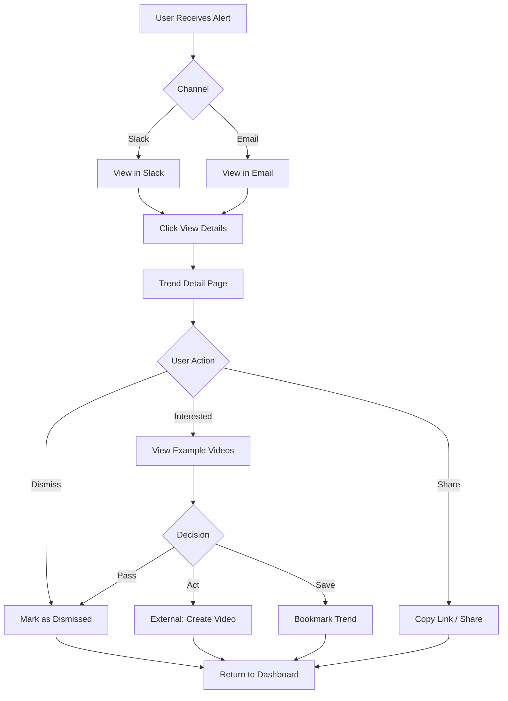
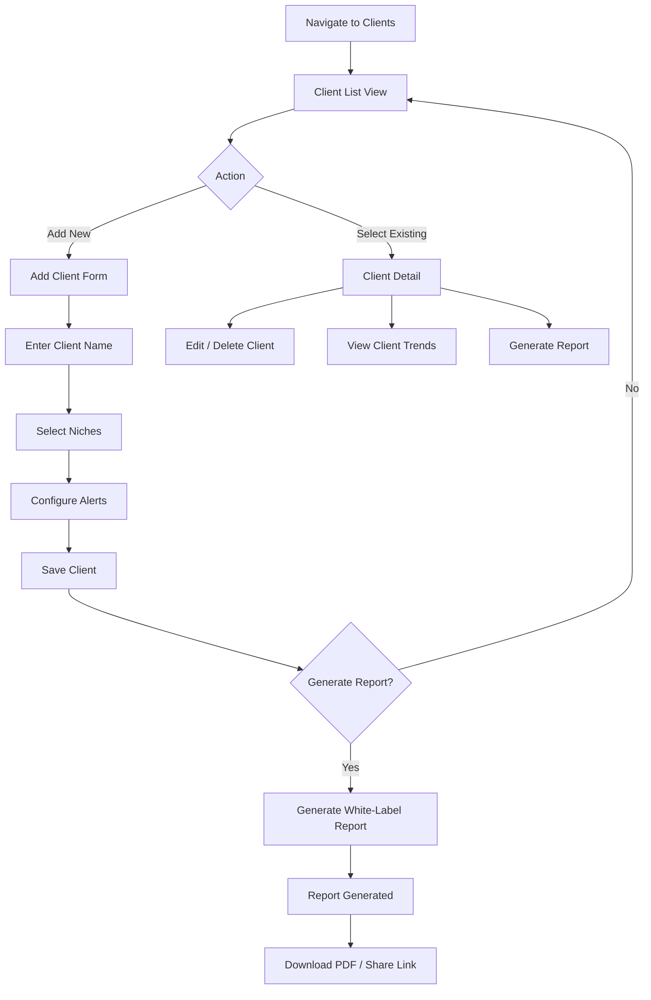

# Trendscope MVP User Experience

> **The Bloomberg Terminal for Short-Form Video Trends**
>
> Real-time trend intelligence. Professional-grade detection. Alerts before the mainstream knows.

---

## Document Information

| Attribute | Value |
|-----------|-------|
| **Product** | Trendscope |
| **Version** | MVP v1.0 |
| **Last Updated** | 2026-02-16 |
| **Status** | Draft - Ready for Review |
| **Owner** | UX Design |

---

## Table of Contents

1. [Phase 1: Minimum Viable Research](#phase-1-minimum-viable-research)
2. [Phase 2: Information Architecture](#phase-2-information-architecture)
3. [Phase 3: Interaction Design](#phase-3-interaction-design)
4. [Phase 4: Accessibility Check](#phase-4-accessibility-check)
5. [Phase 5: Validation](#phase-5-validation)
6. [Phase 6: Documentation & Handoff](#phase-6-documentation--handoff)

---

## Phase 1: Minimum Viable Research

### 1.1 Problem Statement

**Core Problem:**
> Creators and agencies spend 4+ hours daily "doomscrolling" TikTok to find trends, yet still miss the window of opportunity because by the time they spot a trend manually, it's already saturating.

**The Trend Decay Dilemma:**
Trends on TikTok don't build slowly—they explode overnight. A sound with 500 uses growing at 400% per hour is infinitely more valuable than one with 50,000 uses that peaked yesterday. Current tools show what *was* viral (24-48h delay), not what's *about to be* viral.

**Economic Impact:**
- Time cost: $3,000/month in lost productivity (4 hours/day @ $25/hour)
- Opportunity cost: Missing viral windows = lost revenue from Creator Fund, affiliates, brand deals
- Agency cost: Client churn from reactive (not proactive) trend response

### 1.2 User Personas

#### Persona 1: The Hustler (Solo Creator) - PRIMARY

| Attribute | Details |
|-----------|---------|
| **Name** | Sarah |
| **Demographics** | Gen Z/Millennial, 1k-100k followers |
| **Tech Proficiency** | High (digital native, familiar with creator tools) |
| **Primary Goal** | Stay relevant, grow following, monetize content |
| **Pain Points** | Time-starved, FOMO/anxiety about "falling off", manual scrolling burnout |
| **JTBD** | "When I wake up, I want to know which trends are accelerating in my niche, so I can film content that rides the wave." |
| **Success Metric** | Time saved on research > 3 hours/day |
| **Tier** | Solo ($29/mo) |

**Quote:** *"I used to wake up at 6 AM to 'get ahead' of trends. Now I need something that does that while I sleep."*

#### Persona 2: The Agency (Boutique SMMA)

| Attribute | Details |
|-----------|---------|
| **Name** | Mark |
| **Demographics** | Small team (2-10 employees), 5-20 client accounts |
| **Tech Proficiency** | Medium-High (uses multiple SaaS tools) |
| **Primary Goal** | Look proactive to clients, justify retainers, reduce manual research labor |
| **Pain Points** | Overwhelmed, reactive workflow, inconsistent trend spotting across team |
| **JTBD** | "When my client asks why their competitor went viral, I want to show I spotted that trend 24 hours ago." |
| **Success Metric** | Client retention rate, perceived proactivity score |
| **Tier** | Agency ($199/mo) |

**Quote:** *"We need to look like we have a research team. Trendscope's white-label reports do that."*

#### Persona 3: The Brand (In-House Marketing Team)

| Attribute | Details |
|-----------|---------|
| **Name** | Jessica |
| **Demographics** | Marketing manager at mid-sized D2C brand |
| **Tech Proficiency** | Medium (uses marketing stack, less familiar with creator tools) |
| **Primary Goal** | Be "cool" while avoiding PR disasters, justify creative decisions to leadership |
| **Pain Points** | Risk-averse but under pressure to be trendy, needs validation for creative risks |
| **JTBD** | "I need data to back up creative decisions and avoid jumping on the wrong trends." |
| **Success Metric** | Trend prediction accuracy, leadership confidence |
| **Tier** | Enterprise ($499/mo) |

### 1.3 Success Metrics (UX-Driven)

| Metric | Definition | Target | Measurement Method |
|--------|------------|--------|-------------------|
| **Time to Value** | Minutes from signup to first alert received | < 5 minutes | Analytics: onboarding flow timing |
| **Activation Rate** | % of users who complete niche selection + connect alert channel | > 70% | Analytics: onboarding funnel |
| **Alert-to-Action Rate** | % of users who click through on alerts | > 40% | Analytics: alert engagement |
| **Task Success Rate** | % of users who complete core tasks without errors | > 85% | Usability testing |
| **SUS Score** | System Usability Scale score | > 70 | Post-onboarding survey |
| **Daily Active Users** | % of users who view dashboard or receive alerts daily | > 60% of paid | Analytics: DAU/MAU ratio |

### 1.4 MoSCoW Scope

#### Must Have (MVP)

**Core Detection Engine:**
- Self-hosted TikTok scraper with velocity tracking
- Sound and hashtag trend detection
- Multi-region coverage (US, UK, AU)
- Redis hot cache + PostgreSQL storage

**Alert System:**
- Slack integration (webhook-based alerts)
- Email digest (daily/weekly options)
- Tier-based latency: Free (weekly), Solo (2-hour), Agency (30-min)

**User Management:**
- User authentication (Supabase Auth)
- Niche preference selection (beauty, finance, gaming, etc.)
- Basic dashboard showing active trends

#### Should Have (Post-MVP v1.1)

- SMS alerts for Enterprise tier
- Growth rate threshold customization
- Trend confidence scoring
- Basic white-label PDF reports (Agency tier)
- Multi-client management (Agency tier)
- API access (Enterprise tier)

#### Could Have (Post-MVP v1.2)

- AI-generated script suggestions
- Visual similarity detection (CLIP embeddings)
- Competitor tracking
- Cross-niche trend detection
- Mobile app
- Discord bot integration

#### Won't Have (MVP)

- Visual/video analysis (post-MVP)
- Instagram Reels / YouTube Shorts (TikTok-only for MVP)
- Predictive modeling beyond simple velocity
- Influencer outreach/management features
- Content scheduling/posting
- Real-time dashboard updates (near-real-time sufficient)
- Team collaboration features (comments, assignments)
- Advanced analytics beyond trend detection

### 1.5 Primary Use Cases

#### Use Case 1: Onboarding & First Alert (All Tiers)

**User:** New signup (any persona)
**Goal:** Complete setup and receive first trend alert within 24 hours

**Flow:**
1. Sign up with email
2. Verify email
3. Select niches (1 for Free, unlimited for Solo+)
4. Connect alert channel (Slack or email)
5. View dashboard
6. Receive first alert within 24 hours

**Success Criteria:** User completes steps 1-5 in < 5 minutes

#### Use Case 2: Responding to Trend Alert (Solo/Agency)

**User:** Solo Creator or Agency
**Goal:** Review trend details and decide to act

**Flow:**
1. Receive Slack/email alert
2. Click through to trend detail page
3. View velocity graph, saturation score, example videos
4. Click "Create video" (external link) or dismiss

**Success Criteria:** < 30 seconds from alert to decision

#### Use Case 3: Managing Client Workspaces (Agency)

**User:** Agency owner
**Goal:** Set up separate tracking for multiple clients

**Flow:**
1. Navigate to Clients section
2. Add new client workspace
3. Select niches for this client
4. Configure alert destination (client's Slack or team's)
5. Generate white-label report

**Success Criteria:** Add client in < 3 minutes, report generates successfully

#### Use Case 4: Adjusting Alert Preferences (All Tiers)

**User:** Any paying user
**Goal:** Reduce or increase alert frequency/volume

**Flow:**
1. Navigate to Settings
2. Modify niche selections
3. Adjust velocity thresholds (Solo+)
4. Update notification preferences
5. Save changes

**Success Criteria:** Changes reflect within 1 hour

---

### Phase 1 Completion Checklist

- [x] Problem statement written (1-2 sentences)
- [x] 2-3 user personas defined with tech proficiency levels
- [x] Success metrics are quantifiable and measurable
- [x] MoSCoW scope clearly separates Must/Should/Could/Won't
- [x] At least 3 primary use cases documented

---

## Phase 2: Information Architecture

### 2.1 Navigation Structure

**Primary Navigation (Sidebar - B2B SaaS Pattern):**

```
┌─────────────────────────────────────┐
│  🔊 Trendscope                      │
├─────────────────────────────────────┤
│  📊 Dashboard                       │
│  🔥 Trends                          │
│  🔔 Alerts                          │
│  ⚙️ Settings                        │
├─────────────────────────────────────┤
│  [AGENCY TIER]                      │
│  👥 Clients                         │
│  📄 Reports                         │
├─────────────────────────────────────┤
│  👤 Account                         │
│  ? Help                             │
└─────────────────────────────────────┘
```

**Navigation Hierarchy:**

| Level 1 | Level 2 | Level 3 | Description |
|---------|---------|---------|-------------|
| Dashboard | — | — | Overview of active trends, stats |
| Trends | Active | Trend Detail | List + detail view |
| Trends | History | — | Past trends archive |
| Alerts | Configuration | — | Channel setup |
| Alerts | History | — | Past alerts log |
| Settings | Profile | — | User info |
| Settings | Niches | — | Niche preferences |
| Settings | Notifications | — | Frequency, thresholds |
| Settings | Integrations | Slack | Webhook config |
| Settings | Billing | — | Subscription, invoices |
| Clients | [Client List] | Client Detail | Agency: manage workspaces |
| Reports | Generate | — | Agency: white-label reports |
| Reports | History | — | Previously generated |

**Principle:** Broad and shallow hierarchy (max 2 levels deep for primary actions)

### 2.2 User Flows

#### Flow 1: User Onboarding (Signup → First Alert)

```mermaid
flowchart TD
    A[Visit Landing Page] --> B{Has Account?}
    B -->|No| C[Click Sign Up]
    B -->|Yes| D[Login]
    
    C --> E[Enter Email/Password]
    E --> F[Verify Email]
    F --> G[Welcome Screen]
    
    G --> H[Select Niches]
    H --> I{At least 1 selected?}
    I -->|No| H
    I -->|Yes| J[Connect Slack?]
    
    J -->|Yes| K[Enter Webhook URL]
    J -->|No / Skip| L[Test Connection?]
    
    K --> L
    L -->|Success| M[Dashboard]
    L -->|Failed| N[Show Error + Retry]
    N --> K
    
    M --> O[Show "First Alert Coming" Message]
    O --> P[Receive First Alert < 24h]
    
    D --> M
```

**Decision Points:**
- Email verification required before niche selection
- Minimum 1 niche must be selected (validation)
- Slack connection optional (can use email only)
- Webhook validation before proceeding

**Edge Cases:**
- Invalid webhook URL → Show specific error, allow retry
- Email already exists → Suggest login
- Verification email not received → Resend option

#### Flow 2: Trend Discovery (Alert to Action)



**Decision Points:**
- User can dismiss, act on, or save trend
- External link opens TikTok or creator's preferred editing tool

**Edge Cases:**
- Trend expires while viewing → Show "Window Closed" message
- Video examples unavailable → Show placeholder

#### Flow 3: Agency Client Management



### 2.3 Information Hierarchy

**Dashboard Priority (Top to Bottom):**

1. **Stats Overview** (at-a-glance metrics)
   - Active trends count
   - Trends detected today
   - Alerts sent this week
   - Time saved (calculated)

2. **Hot Trends** (actionable now)
   - Top 3-5 trends with highest velocity
   - Quick action buttons

3. **Recent Alerts** (history)
   - Last 5 alerts with status

4. **Quick Actions**
   - Add niche
   - Configure alerts
   - Generate report (Agency)

**Trend Detail Priority:**

1. **Trend Header**
   - Name/type
   - Current velocity
   - Saturation score
   - Time window remaining

2. **Visual Data**
   - Velocity graph (last 24h)
   - Growth trajectory

3. **Context**
   - Example videos (3 thumbnails)
   - Related hashtags/sounds

4. **Actions**
   - Create video (external link)
   - Bookmark
   - Dismiss
   - Share

### Phase 2 Completion Checklist

- [x] User flows created for all primary use cases
- [x] Decision points and error paths documented in flows
- [x] Navigation structure defined (sidebar)
- [x] Information hierarchy is broad and shallow (≤2 levels)
- [x] Edge cases identified and noted

---

## Phase 3: Interaction Design

### 3.1 Screen Specifications

#### Screen 1: Dashboard

**Purpose:** At-a-glance overview and primary entry point

---

##### State A: Ideal State

**Description:** User has active trends, fully populated dashboard

**Layout:**
```
┌─────────────────────────────────────────────────────────────────┐
│  🔊 Trendscope                                     [👤 Account]  │
├────────────────┬────────────────────────────────────────────────┤
│                │  Welcome back, Sarah                           │
│  📊 Dashboard  │                                                │
│  🔥 Trends     │  ┌──────────┐ ┌──────────┐ ┌──────────┐       │
│  🔔 Alerts     │  │ 12       │ │ 3        │ │ 28       │       │
│  ⚙️ Settings   │  │ Active   │ │ Today    │ │ This Week│       │
│                │  │ Trends   │ │ Detected │ │ Alerts   │       │
│                │  └──────────┘ └──────────┘ └──────────┘       │
│                │                                                │
│                │  🔥 Hot Trends                                 │
│                │  ┌──────────────────────────────────────────┐ │
│                │  │ 🔊 "Soft Glam"                    +340%  │ │
│                │  │ #beauty • 2,891 videos • 6hr window      │ │
│                │  │ [View →]                          [🔖]   │ │
│                │  └──────────────────────────────────────────┘ │
│                │  ┌──────────────────────────────────────────┐ │
│                │  │ 📈 #QuietLuxury                   +280%  │ │
│                │  │ #fashion • 1,234 videos • 12hr window    │ │
│                │  │ [View →]                          [🔖]   │ │
│                │  └──────────────────────────────────────────┘ │
│                │                                                │
│                │  Recent Alerts                                 │
│                │  • 2 hours ago — Sound alert in #beauty        │
│                │  • 5 hours ago — Hashtag alert in #finance     │
│                │                                                │
└────────────────┴────────────────────────────────────────────────┘
```

**Behavioral Annotations:**
1. Stats cards update every 15 minutes
2. Hot Trends sorted by velocity score (highest first)
3. Bookmark icon toggles saved state
4. Clicking trend card navigates to detail
5. "View →" primary action button

---

##### State B: Empty State (First-Time User)

**Description:** User just signed up, no trends detected yet

**Copy (Brand Voice - Sharp, Encouraging):**

```
┌─────────────────────────────────────────────────────────────────┐
│                                                                 │
│                    📡 Monitoring Active                         │
│                                                                 │
│         No trends detected yet in your selected niches.         │
│                                                                 │
│         First alert typically arrives within 6-24 hours.        │
│         Add more niches to expand coverage.                     │
│                                                                 │
│              [Add Niches →]  [View All Niches →]                │
│                                                                 │
│         ─────────────────────────────────────────────           │
│         Monitoring: #beauty, #fashion                           │
│         Last scan: 2 minutes ago                                │
│                                                                 │
└─────────────────────────────────────────────────────────────────┘
```

**Behavioral Annotations:**
1. Show "Monitoring Active" status prominently (builds trust)
2. Primary CTA: Add more niches
3. Secondary CTA: View niche catalog
4. Display current monitoring status
5. Show last scan timestamp (proves system is working)

---

##### State C: Loading State

**Description:** Dashboard data is being fetched

**Layout:**
```
┌─────────────────────────────────────────────────────────────────┐
│                                                                 │
│  ┌──────────┐  ┌──────────┐  ┌──────────┐                      │
│  │ ▓▓▓▓░░░░ │  │ ▓▓▓▓░░░░ │  │ ▓▓▓▓░░░░ │  (Skeleton pulse)  │
│  │ ░░░░░░░░ │  │ ░░░░░░░░ │  │ ░░░░░░░░ │                      │
│  └──────────┘  └──────────┘  └──────────┘                      │
│                                                                 │
│  ┌──────────────────────────────────────────────────────────┐  │
│  │ ▓▓▓▓▓▓▓▓▓▓▓▓▓▓░░░░░░░░░░░░░░░░░░░░░░░░░░░░░░░░░░░░░░░ │  │
│  │ ░░░░░░░░░░░░░░░░░░░░░░░░░░░░░░░░░░░░░░░░░░░░░░░░░░░░░░ │  │
│  │ ░░░░░░░░░░░░░░░░░░░░░░░░░░░░░░░░░░░░░░░░░░░░░░░░░░░░░░ │  │
│  └──────────────────────────────────────────────────────────┘  │
│                                                                 │
└─────────────────────────────────────────────────────────────────┘
```

**Behavioral Annotations:**
1. Skeleton screens with pulsing animation (1500ms ease-in-out)
2. No generic spinners—shapes match final content
3. Load stats first, then trends list
4. Maximum 3 seconds before showing partial data

---

##### State D: Error State

**Description:** Failed to load dashboard data

**Copy (Brand Voice - Helpful, Clear):**

```
┌─────────────────────────────────────────────────────────────────┐
│                                                                 │
│                     ⚠️  Data Temporarily Unavailable            │
│                                                                 │
│         Unable to load trend data. Retrying automatically.      │
│                                                                 │
│         Last successful update: 12 minutes ago                  │
│         Retry attempt: 3 of 5                                   │
│                                                                 │
│              [Retry Now]  [View Cached Data →]                  │
│                                                                 │
│         ─────────────────────────────────────────────           │
│         Alerts still being delivered. Check your Slack/email.   │
│                                                                 │
└─────────────────────────────────────────────────────────────────┘
```

**Behavioral Annotations:**
1. Icon + text error (not color alone)
2. Show last successful update time
3. Retry counter (progress indication)
4. Primary CTA: Retry Now
5. Secondary CTA: View cached/stale data
6. Reassurance: Alerts still working (service degradation, not outage)

---

#### Screen 2: Trend Detail

**Purpose:** Deep dive into a specific trend with data and actions

---

##### State A: Ideal State

**Layout:**
```
┌─────────────────────────────────────────────────────────────────┐
│  ← Back to Dashboard                                            │
├─────────────────────────────────────────────────────────────────┤
│                                                                 │
│  🔊 "Soft Glam Transformation"                          [🔖]    │
│  ━━━━━━━━━━━━━━━━━━━━━━━━━━━━━                                  │
│                                                                 │
│  Velocity: ████████████████████  89/100                         │
│  Saturation: ████░░░░░░░░░░░░░░  12%  🟢 Window: 6-8 hours      │
│                                                                 │
│  [📈 Velocity Graph - Last 24 Hours]                            │
│                                                                 │
│  ┌─────────────────────────────────────────────────────────┐   │
│  │                                                         │   │
│  │              ╱╲                                         │   │
│  │             ╱  ╲     ╱╲                                 │   │
│  │    ╱╲      ╱    ╲   ╱  ╲    ╱╲                         │   │
│  │___╱  ╲____╱      ╲_╱    ╲__╱  ╲____________________    │   │
│  │                                                         │   │
│  │  -24h    -18h    -12h    -6h    Now                     │   │
│  └─────────────────────────────────────────────────────────┘   │
│                                                                 │
│  Stats: 847 → 2,891 videos (+340% in 3 hours)                   │
│  Niche: #beauty                                                 │
│  Detected: 2 hours ago                                          │
│  Source: Micro-influencer layer (<10k followers)                │
│                                                                 │
│  Example Videos:                                                │
│  ┌─────────┐ ┌─────────┐ ┌─────────┐                           │
│  │ ▶️      │ │ ▶️      │ │ ▶️      │                           │
│  │ 12.4K   │ │ 8.2K    │ │ 45.1K   │                           │
│  └─────────┘ └─────────┘ └─────────┘                           │
│                                                                 │
│  Related: #makeup, #transformation, #grwm                       │
│                                                                 │
│  [Create Video →]  [Dismiss]  [Share →]                         │
│                                                                 │
└─────────────────────────────────────────────────────────────────┘
```

**Behavioral Annotations:**
1. Velocity score with visual bar (0-100 scale)
2. Saturation color-coded: 🟢 <30%, 🟡 30-70%, 🔴 >70%
3. Graph shows 24-hour velocity trend
4. Video thumbnails link to TikTok (external)
5. "Create Video" primary action (opens TikTok camera or editing app)
6. Bookmark icon in header

---

##### State B: Empty State (No Examples Available)

**Copy:**
```
┌─────────────────────────────────────────────────────────────────┐
│  🔊 "Sound Name"                                                │
├─────────────────────────────────────────────────────────────────┤
│                                                                 │
│  [Velocity data as above]                                       │
│                                                                 │
│  Example Videos:                                                │
│                                                                 │
│  ┌─────────────────────────────────────────────────────────┐   │
│  │                                                         │   │
│  │              📹                                         │   │
│  │                                                         │   │
│  │      Example videos collecting. Check back in 1 hour.   │   │
│  │                                                         │   │
│  └─────────────────────────────────────────────────────────┘   │
│                                                                 │
└─────────────────────────────────────────────────────────────────┘
```

---

##### State C: Loading State

**Layout:**
```
│  🔊 ▓▓▓▓▓▓▓▓▓▓▓▓▓▓▓▓▓▓▓▓▓▓▓▓▓▓▓▓▓▓▓▓▓▓▓▓▓▓▓▓▓▓▓▓▓▓▓▓▓▓▓▓    │
│  ━━━━━━━━━━━━━━━━━━━━━━━━━━━━━                                  │
│                                                                 │
│  Velocity: ▓▓▓▓▓▓▓▓▓▓▓▓▓▓▓▓▓▓▓▓▓▓▓▓  ▓▓/100                   │
│  [Graph skeleton with pulsing animation]                        │
│                                                                 │
│  Loading trend data...                                          │
```

---

##### State D: Error State (Trend Not Found)

**Copy:**
```
┌─────────────────────────────────────────────────────────────────┐
│                                                                 │
│                     ❌ Trend Not Found                          │
│                                                                 │
│         This trend may have expired or been removed.            │
│                                                                 │
│              [Browse Active Trends →]                           │
│                                                                 │
└─────────────────────────────────────────────────────────────────┘
```

---

#### Screen 3: Onboarding - Niche Selection

**Purpose:** First-run experience—select niches to monitor

---

##### State A: Ideal State (During Selection)

**Layout:**
```
┌─────────────────────────────────────────────────────────────────┐
│  Step 2 of 3: Select Your Niches                                │
├─────────────────────────────────────────────────────────────────┤
│                                                                 │
│  What content do you create? We'll monitor these niches for     │
│  emerging trends.                                               │
│                                                                 │
│  ┌─────────────────────────────────────────────────────────┐   │
│  │ 🔍 Search niches...                                     │   │
│  └─────────────────────────────────────────────────────────┘   │
│                                                                 │
│  Popular Niches:                                                │
│  ┌────────────┐ ┌────────────┐ ┌────────────┐ ┌────────────┐   │
│  │ ✓ Beauty   │ │ ✓ Fashion  │ │   Gaming   │ │   Finance  │   │
│  │   2.3K     │ │   1.8K     │ │   4.1K     │ │   892      │   │
│  └────────────┘ └────────────┘ └────────────┘ └────────────┘   │
│  ┌────────────┐ ┌────────────┐ ┌────────────┐ ┌────────────┐   │
│  │   Comedy   │ │   Food     │ │   Fitness  │ │   Travel   │   │
│  │   3.4K     │ │   2.1K     │ │   1.5K     │ │   987      │   │
│  └────────────┘ └────────────┘ └────────────┘ └────────────┘   │
│                                                                 │
│  Selected: 2 of 5 (Solo plan)                                   │
│  ✓ Beauty  ✓ Fashion                                            │
│                                                                 │
│              [← Back]        [Continue →]                       │
│                                                                 │
└─────────────────────────────────────────────────────────────────┘
```

**Behavioral Annotations:**
1. Show selection limit for tier (Free: 1, Solo: 5, Agency: 12)
2. Niche cards toggle selection with visual feedback
3. Search filters available niches
4. Show trend volume per niche (social proof)
5. Continue disabled until ≥1 niche selected

---

##### State B: Empty State (Search Returns No Results)

**Copy:**
```
┌─────────────────────────────────────────────────────────────────┐
│  Search: "underwater basket weaving"                            │
├─────────────────────────────────────────────────────────────────┤
│                                                                 │
│                     🔍 No Niches Found                          │
│                                                                 │
│         Try different keywords or browse all categories.        │
│                                                                 │
│              [Clear Search]  [Browse All →]                     │
│                                                                 │
└─────────────────────────────────────────────────────────────────┘
```

---

##### State C: Loading State

```
Loading niches...       [spinner]
```

---

##### State D: Error State

**Copy:**
```
┌─────────────────────────────────────────────────────────────────┐
│                                                                 │
│                     ⚠️  Unable to Load Niches                   │
│                                                                 │
│         Check your connection and try again.                    │
│                                                                 │
│              [Retry]                                            │
│                                                                 │
└─────────────────────────────────────────────────────────────────┘
```

---

#### Screen 4: Settings - Slack Integration

**Purpose:** Configure Slack webhook for trend alerts

---

##### State A: Ideal State (Connected)

**Layout:**
```
┌─────────────────────────────────────────────────────────────────┐
│  ⚙️ Settings > Integrations > Slack                             │
├─────────────────────────────────────────────────────────────────┤
│                                                                 │
│  Slack Integration                                    [● Connected]
│                                                                 │
│  Channel: #trend-alerts                                         │
│  Webhook: https://hooks.slack.com/services/...x8f2              │
│  Connected: 3 days ago                                          │
│  Last test: ✓ Successful (2 minutes ago)                        │
│                                                                 │
│  Alert Format:                                                  │
│  ○ Compact (title only)                                         │
│  ● Detailed (with stats)                                        │
│                                                                 │
│  [Test Connection]  [Disconnect]                                │
│                                                                 │
└─────────────────────────────────────────────────────────────────┘
```

---

##### State B: Empty State (Not Connected)

**Copy:**
```
┌─────────────────────────────────────────────────────────────────┐
│  Slack Integration                                       [○ Off]│
├─────────────────────────────────────────────────────────────────┤
│                                                                 │
│  Get instant trend alerts in your Slack workspace.              │
│                                                                 │
│  1. Create a webhook in your Slack workspace:                   │
│     [Slack API Console →]                                       │
│                                                                 │
│  2. Paste webhook URL:                                          │
│     ┌─────────────────────────────────────────────────────┐    │
│     │ https://hooks.slack.com/services/...                │    │
│     └─────────────────────────────────────────────────────┘    │
│                                                                 │
│              [Connect Slack →]                                  │
│                                                                 │
│  ─────────────────────────────────────────────────────────────  │
│  Prefer email? Configure in Settings → Notifications            │
│                                                                 │
└─────────────────────────────────────────────────────────────────┘
```

---

##### State C: Loading State (Testing Connection)

```
Testing webhook...    [spinner]
```

---

##### State D: Error State (Invalid Webhook)

**Copy:**
```
┌─────────────────────────────────────────────────────────────────┐
│                                                                 │
│                     ❌ Connection Failed                          │
│                                                                 │
│         Invalid webhook URL. Check format:                      │
│         https://hooks.slack.com/services/T00000000/...          │
│                                                                 │
│              [Retry]  [View Setup Guide →]                      │
│                                                                 │
└─────────────────────────────────────────────────────────────────┘
```

### 3.2 Component Specifications

#### Buttons

| Variant | Default | Hover | Focus | Pressed | Disabled | Loading |
|---------|---------|-------|-------|---------|----------|---------|
| **Primary** | BG: #3B82F6, Text: #FFF | BG: #2563EB | Ring: 2px #BFDBFE | Scale: 0.98 | BG: #94A3B8 | Spinner replaces text |
| **Secondary** | BG: Transparent, Border: #E2E8F0 | BG: #F1F5F9 | Ring: 2px #BFDBFE | Scale: 0.98 | Opacity: 0.5 | Spinner + text |
| **Destructive** | BG: #EF4444, Text: #FFF | BG: #DC2626 | Ring: 2px #FECACA | Scale: 0.98 | BG: #FCA5A5 | Spinner |

**All Buttons:**
- Padding: 12px 24px
- Border radius: 6px
- Font: 14px, weight 600
- Cursor: pointer (default), not-allowed (disabled)
- Transition: 150ms ease-out

#### Form Inputs

| State | Visual |
|-------|--------|
| **Default** | Border: 1px #E2E8F0, BG: #FFF |
| **Focus** | Border: #3B82F6, Ring: 2px #BFDBFE |
| **Error** | Border: #EF4444, Icon: ❌ |
| **Disabled** | BG: #F1F5F9, Text: #94A3B8 |
| **Filled** | Border: #E2E8F0, Label floats up |

**Specifications:**
- Padding: 10px 14px
- Border radius: 6px
- Font: 14px
- Label: 14px, weight 500, #334155, positioned above
- Placeholder: #94A3B8
- Error message: 12px, #EF4444, below input

#### Niche Selection Cards

| State | Visual |
|-------|--------|
| **Default** | Border: 1px #E2E8F0, BG: #FFF |
| **Hover** | Border: #3B82F6, Shadow: 0 2px 4px rgba(0,0,0,0.1) |
| **Selected** | Border: #3B82F6, BG: #EFF6FF, Checkmark icon |
| **Disabled** (limit reached) | Opacity: 0.5, cursor: not-allowed |
| **Loading** | Skeleton pulse on stats |

#### Trend Cards

| State | Visual |
|-------|--------|
| **Default** | Border: 1px #E2E8F0, BG: #FFF |
| **Hover** | Border: #3B82F6, Shadow: 0 4px 6px rgba(0,0,0,0.1) |
| **Hot** (velocity >80) | Left border: 4px #F59E0B, "🔥" badge |
| **Bookmarked** | Bookmark icon: filled #3B82F6 |
| **Expiring** (<2hr window) | Saturation badge: red pulse animation |

#### Badges

| Type | BG | Text | Use |
|------|-----|------|-----|
| **Velocity High** | #FEF3C7 | #92400E | Velocity >80 |
| **Velocity Medium** | #FEF9C3 | #854D0E | Velocity 40-80 |
| **Velocity Low** | #F1F5F9 | #475569 | Velocity <40 |
| **Saturation Low** | #D1FAE5 | #065F46 | <30% |
| **Saturation Medium** | #FEF3C7 | #92400E | 30-70% |
| **Saturation High** | #FEE2E2 | #991B1B | >70% |
| **Status Active** | #D1FAE5 | #065F46 | System operational |
| **Status Warning** | #FEF3C7 | #92400E | Degraded service |
| **Status Error** | #FEE2E2 | #991B1B | System down |

### Phase 3 Completion Checklist

- [x] All major screens have 4 states documented (ideal, empty, loading, error)
- [x] Interactive components have 6 states defined (default, hover, focus, pressed, disabled, loading)
- [x] Behavioral annotations added for complex interactions
- [x] Fidelity appropriate for current stage (text-based wireframes)
- [x] Wireframes created for critical user flows

---

## Phase 4: Accessibility Check

### 4.1 WCAG 2.1 Level AA Compliance

#### Color Contrast Verification

| Element | Foreground | Background | Ratio | Required | Status |
|---------|------------|------------|-------|----------|--------|
| Primary text | #0F172A | #FFFFFF | 15.8:1 | 4.5:1 | ✅ Pass |
| Body text | #475569 | #FFFFFF | 6.0:1 | 4.5:1 | ✅ Pass |
| Accent button | #FFFFFF | #3B82F6 | 3.9:1 | 3.0:1 (large) | ✅ Pass |
| Secondary text | #64748B | #FFFFFF | 4.6:1 | 4.5:1 | ✅ Pass |
| Error text | #991B1B | #FEE2E2 | 7.1:1 | 4.5:1 | ✅ Pass |
| Success text | #065F46 | #D1FAE5 | 6.2:1 | 4.5:1 | ✅ Pass |
| White on dark | #F8FAFC | #0F172A | 16.1:1 | 4.5:1 | ✅ Pass |
| Placeholder | #94A3B8 | #FFFFFF | 2.7:1 | — | ⚠️ Info only |
| Disabled | #94A3B8 | #F1F5F9 | 2.3:1 | — | ⚠️ Disabled exempt |

#### Keyboard Navigation

| Element | Tab Order | Focus Indicator | Action Keys |
|---------|-----------|-----------------|-------------|
| Navigation links | 1-4 | 2px ring #3B82F6 | Enter to activate |
| Trend cards | Sequential | Border + shadow | Enter to open |
| Buttons | Logical flow | 2px ring #BFDBFE | Enter/Space |
| Form inputs | Top-to-bottom | Border highlight | Type to input |
| Niche cards | Grid (left-right, top-bottom) | Border #3B82F6 | Space to toggle |
| Modals | Trap focus inside | Overlay + content ring | Esc to close |
| Skip link | First (hidden until focused) | Visible underline | Enter to skip |

**Keyboard Shortcuts (Power Users):**
- `/` - Focus search
- `Esc` - Close modal/dropdown
- `?` - Show keyboard shortcuts help

#### Screen Reader Support

| Element | ARIA Role | Label/Description |
|---------|-----------|-------------------|
| Trend card | `article` | Trend name + velocity |
| Velocity bar | `meter` | `aria-valuenow`, `aria-valuemin`, `aria-valuemax` |
| Saturation badge | `status` | "Saturation: X%" |
| Navigation | `nav` | `aria-label="Main navigation"` |
| Sidebar | `complementary` | `aria-label="Sidebar"` |
| Live alerts | `alert` | `aria-live="polite"` for new trend notifications |
| Loading states | `progressbar` | "Loading trends..." |

#### Focus Management

- **Focus visible:** Never suppress focus indicator
- **Focus order:** Logical, matches visual order
- **Focus trap:** In modals, focus cycles within
- **Focus restore:** Return focus to trigger after modal close

#### Form Accessibility

- **Labels:** Persistent labels (not just placeholders)
- **Required fields:** Marked with `*` + `aria-required="true"`
- **Error messages:** Linked with `aria-describedby`
- **Fieldsets:** Group related inputs (e.g., niche selection)

#### Motion & Animation

- **Reduced motion:** Respect `prefers-reduced-motion`
  - Disable pulsing animations
  - Instant state changes instead of transitions
- **No auto-play:** No auto-playing video/audio
- **Flashing:** No content flashes >3 times/second

### Phase 4 Completion Checklist

- [x] Color contrast ratios meet WCAG AA (4.5:1 for text, 3:1 for large text)
- [x] All interactive elements are keyboard navigable
- [x] Focus states are visible and clear
- [x] Form labels are persistent (not just placeholders)
- [x] Errors use icon + text, not color alone
- [x] Alt text specified for all informative images
- [x] Heading hierarchy is logical (H1 → H2 → H3)
- [x] ARIA roles and labels defined for custom components

---

## Phase 5: Validation

### 5.1 Testing Strategy

**Method:** Moderated usability testing (remote via Zoom)

**Participants:** 5 users matching target personas
- 3 Solo Creators (1k-100k followers)
- 2 Agency owners/managers

**Testing Approach:**
1. **Pre-test questionnaire:** Tech proficiency, current workflow
2. **Task-based testing:** 5 core tasks (see below)
3. **Think-aloud protocol:** Users verbalize thoughts
4. **Post-test SUS survey:** Standard System Usability Scale
5. **Debrief:** Open-ended feedback

### 5.2 Test Tasks & Success Criteria

| Task | Description | Success Criteria | Target |
|------|-------------|------------------|--------|
| **1. Complete Onboarding** | Sign up, select niches, connect Slack | Complete in < 5 minutes | 100% |
| **2. Find Trend Details** | From dashboard, open a trend, view velocity | Find and open in < 30 seconds | 100% |
| **3. Understand Trend Data** | Explain what "saturation 23%" means | Correct interpretation | 80% |
| **4. Add New Niche** | Add a niche from settings | Complete without help | 100% |
| **5. Dismiss Alert** | Mark a trend as not interested | Find dismiss action | 80% |

### 5.3 Success Metrics Targets

| Metric | Target | Measurement |
|--------|--------|-------------|
| **Task Success Rate** | >80% | 4/5 users complete each task |
| **Time on Task** | < target | Measured per task |
| **Error Rate** | <20% | Mistakes, backtracking, confusion |
| **SUS Score** | >70 | Standard 10-question survey |
| **NPS** | >30 | "How likely to recommend?" |

### 5.4 Testing Schedule

| Phase | Activity | Timeline |
|-------|----------|----------|
| **Pre-test** | Recruit participants, prepare prototype | Week 1 |
| **Testing** | 5 sessions (1 hour each) | Week 2 |
| **Analysis** | Compile findings, identify patterns | Week 2-3 |
| **Iteration** | Design changes based on findings | Week 3 |
| **Validation** | Re-test critical fixes (3 users) | Week 4 |

### 5.5 Known Assumptions to Validate

1. **Niche terminology:** Do users understand "niche" vs "category"?
2. **Velocity concept:** Is velocity score intuitive without explanation?
3. **Saturation understanding:** Do users grasp what saturation % means?
4. **Alert frequency:** Is 2-hour latency "fast enough" for Solo tier?
5. **Slack vs Email:** Do users prefer one channel strongly?

### Phase 5 Completion Checklist

- [ ] Testing completed with at least 5 users matching target personas
- [ ] Success rate for critical flows >80%
- [ ] Major usability issues identified and documented
- [ ] Design iterations made based on test findings
- [ ] Success metrics from Phase 1 can be measured with current design
- [ ] If issues found: Return to Phase 3, iterate, and retest

*Note: Validation testing to be completed post-design handoff, prior to development start.*

---

## Phase 6: Documentation & Handoff

### 6.1 Design Decisions Log

| Decision | Rationale | Date |
|----------|-----------|------|
| Sidebar navigation | Scalable for B2B SaaS, familiar pattern | 2026-02-16 |
| 4-state documentation | Reduces developer ambiguity, improves UX edge cases | 2026-02-16 |
| Tier-based latency | Clear differentiation, aligns with value | 2026-02-16 |
| Velocity score 0-100 | Easy to understand at a glance | 2026-02-16 |
| Saturation % + color | Combines precision (number) with speed (color) | 2026-02-16 |
| Skeleton loading | Reduces perceived load time vs spinners | 2026-02-16 |

### 6.2 Open Questions

| Question | Status | Owner | Impact |
|----------|--------|-------|--------|
| Maximum trends shown on dashboard? | Open | Product | Pagination vs infinite scroll |
| Trend expiration logic? | Open | Engineering | When to archive old trends |
| Slack webhook security validation? | Open | Security | Rate limiting, verification |
| Mobile app scope for MVP? | Decided: No | Product | Post-MVP consideration |
| White-label report format? | Open | Design | PDF template design |

### 6.3 Technical Dependencies

| Feature | Dependency | Notes |
|---------|------------|-------|
| Velocity graphs | Charting library | Recharts, Chart.js, or D3 |
| Slack integration | Webhook validation | Backend verification needed |
| Real-time alerts | WebSocket or polling | Determine latency requirements |
| PDF reports | PDF generation | React-PDF or server-side |

### 6.4 Handoff Checklist

**For Engineering:**
- [x] All 4 states documented for major screens
- [x] Component states defined
- [x] User flows with decision points
- [x] Accessibility requirements specified
- [x] Brand colors, typography referenced
- [x] Behavioral annotations included

**For Product:**
- [x] Success metrics defined
- [x] Use cases documented
- [x] Edge cases identified
- [x] Open questions listed
- [x] MoSCoW scope clear

**For QA:**
- [x] Error states defined
- [x] Loading states specified
- [x] Validation rules documented
- [x] Accessibility test criteria

### 6.5 Post-Handoff Activities

1. **Design QA:** Review implemented designs for accuracy
2. **Analytics Setup:** Implement tracking for success metrics
3. **Beta Feedback:** Gather feedback from early users
4. **Iteration Planning:** Prioritize improvements based on data

---

## Appendices

### A. Brand Voice Quick Reference

**Always:**
- Sharp: "Trend detected" not "We found something!"
- Reliable: "Monitoring 24/7" not "Usually works"
- Fast: "Alert sent" not "Notification scheduled"
- Professional: "Your weekly digest" not "Hey fam!"

**Never:**
- "Just", "Really", "Very", "Things", "Stuff"
- Excessive emoji
- "Oops!" or "Ouch!"
- Hedging: "We think", "You might", "Probably"

### B. Glossary

| Term | Definition |
|------|------------|
| **Alert** | Notification sent when trend detected |
| **Detected** | Trend identified by monitoring system |
| **Latency** | Time between trend emergence and alert |
| **Niche** | Content category (beauty, finance, etc.) |
| **Saturation** | Percentage of trend lifecycle completed |
| **Velocity** | Growth rate of trend over time |
| **Window** | Time remaining to capitalize on trend |

### C. Responsive Breakpoints

| Breakpoint | Width | Adjustments |
|------------|-------|-------------|
| **Desktop** | >1280px | Full sidebar, multi-column |
| **Tablet** | 768-1279px | Collapsible sidebar, 2-column |
| **Mobile** | <768px | Bottom nav, single column, view-only |

### D. Animation Timing

| Animation | Duration | Easing |
|-----------|----------|--------|
| Button hover | 150ms | ease-out |
| Modal open | 200ms | ease-out |
| Page transition | 300ms | ease-in-out |
| Skeleton pulse | 1500ms | ease-in-out |
| Toast appear | 300ms | ease-out |
| Live indicator | 1000ms | linear |

---

*Document Version: 1.0*
*Last Updated: 2026-02-16*
*Next Review: Post-usability testing*
